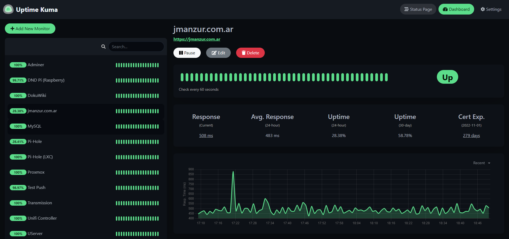

# Uptime-Kuma deployment with Ansible and Docker-Compose

Uptime-Kuma is a open source, lightweight (but powerful), self-hosted monitoring tool. 



### **Features:**

- Monitoring uptime for HTTP(s) / TCP / HTTP(s) Keyword / Ping / DNS Record / Push / Steam Game Server.

> 💡 Push Monitoring exposes an API endpoint that you can send a GET request to, and this is one of the most powerful features of uptime kuma.

- Fancy, Reactive, Fast UI/UX.
- Notifications via Telegram, Microsoft Team, Discord, Gotify, Slack, Pushover, Email (SMTP), and 70+ notification services, [click here for the full list.](https://github.com/louislam/uptime-kuma/tree/master/src/components/notifications)
- 20 second intervals.
- [Multi Languages](https://github.com/louislam/uptime-kuma/tree/master/src/languages)
- Simple Status Page
- Ping Chart
- Certificate Info

## Tested with: 

| Environment | Application | Version  |
| ----------------- |-----------|---------|
| WSL2 Ubuntu 20.04 | Ansible | v2.9.6 |

## Prerequisites. 

Install [sshpass](https://linux.die.net/man/1/sshpass) and [Ansible](https://www.ansible.com/).

Ubuntu:
```bash
sudo apt-get install sshpass && sudo apt-get install ansible -y
```

macOS:
```bash
# Ansible:
CFLAGS=-Qunused-arguments CPPFLAGS=-Qunused-arguments pip install --user ansible

# sshpass
brew install hudochenkov/sshpass/sshpass
```

## Deployment How-To:

1. Clone this repository to your local machine.
2. cd into the project folder.
3. Edit vars.yml adding your server IP and User.
4. Make install.sh executable. 

    ```bash
    chmod +x install.sh
    ```
5. Run it.
    ```bash
    ./install.sh
    ```
6. Go to: http://YourServerIP:3001

## Author:

- [@JManzur](https://jmanzur.com)

## Documentation:

- [Uptime-Kuma Official Repository](https://github.com/louislam/uptime-kuma)